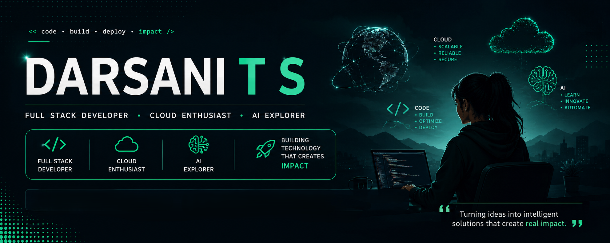

<h1>Hi 👋, I'm Darsani T S</h1>

<h3>Full Stack Developer • Cloud Enthusiast • AI Explorer</h3>

## 🚀 About Me

<ul>
<li>🎓 ECE student exploring <b>Full Stack</b>, <b>Cloud</b> and <b>AI</b>.</li>
<li>💼 Full Stack Developer Intern @ <b>Crayon'd</b>.</li>
<li>☁️ Google Cloud Arcade Facilitator.</li>
<li>🤖 Passionate about AI-powered applications.</li>
<li>🌱 Currently learning AWS Architecture, System Design and Generative AI.</li>
<li>🚀 Building projects that create real-world impact.</li>
<li>🎯 Turning ideas into products.</li>
</ul>

## ⚡ Tech Stack

| **Category** | **Technologies** |
|--------------|------------------|
| **Programming Languages** |       |
| **Frontend Development** |       |
| **Backend Development** |   |
| **Databases** |   |
| **Cloud & DevOps** |      |
| **Tools & Platforms** |    |

## 🚀 Work Highlights

<table align="center">

<tr>
<th align="center">Project</th>
<th>Description</th>
<th align="center">Tech Stack</th>
<th align="center">Links</th>
</tr>

<tr>
<td align="center"><b>✈️ AI Travel Recommendation System</b></td>
<td>AI-powered travel planner with personalized trip recommendations.</td>
<td align="center">

</td>
<td align="center">
<a href="YOUR_DEMO_LINK">🔗 Live</a> 
<a href="YOUR_GITHUB_LINK">📂 Code</a>
</td>
</tr>

<tr>
<td align="center"><b>💧 Aurora Smart Water Dashboard</b></td>
<td>Real-time water quality monitoring and analytics dashboard.</td>
<td align="center">

</td>
<td align="center">
<a href="YOUR_DEMO_LINK">🔗 Demo</a> 
<a href="YOUR_GITHUB_LINK">📂 Code</a>
</td>
</tr>

<tr>
<td align="center"><b>☁️ AWS CI/CD Pipeline</b></td>
<td>Automated cloud deployment and delivery workflow.</td>
<td align="center">

</td>
<td align="center">
<a href="YOUR_DEMO_LINK">🔗 Demo</a> 
<a href="YOUR_GITHUB_LINK">📂 Code</a>
</td>
</tr>

<tr>
<td align="center"><b>📚 Material Transaction Dashboard</b></td>
<td>Educational content distribution and tracking platform.</td>
<td align="center">

</td>
<td align="center">
<a href="YOUR_DEMO_LINK">🔗 Demo</a> 
<a href="YOUR_GITHUB_LINK">📂 Code</a>
</td>
</tr>

<tr>
<td align="center"><b>🌾 Smart Agriculture IoT</b></td>
<td>IoT-based crop and environmental monitoring system.</td>
<td align="center">

</td>
<td align="center">
<a href="YOUR_DEMO_LINK">🔗 Demo</a> 
<a href="YOUR_GITHUB_LINK">📂 Code</a>
</td>
</tr>

<tr>
<td align="center"><b>🎬 Disney+ Hotstar Clone</b></td>
<td>Flutter-based streaming platform UI clone.</td>
<td align="center">

</td>
<td align="center">
<a href="YOUR_DEMO_LINK">🔗 Demo</a> 
<a href="YOUR_GITHUB_LINK">📂 Code</a>
</td>
</tr>

</table>

## 📊 GitHub Analytics

<table align="center">
<tr>

<td>

</td>

<td>

</td>

<td>

</td>

</tr>
</table>

 

<h2>🧠 LeetCode & 🎲 Random Facts</h2>

<table width="100%">
<tr>

<td width="55%" valign="top" align="center">

<h3>🧠 LeetCode Progress</h3>

</td>

<td width="45%" valign="top" align="center">

<h3>💡 Developer Inspiration</h3>

</td>

</tr>
</table>
